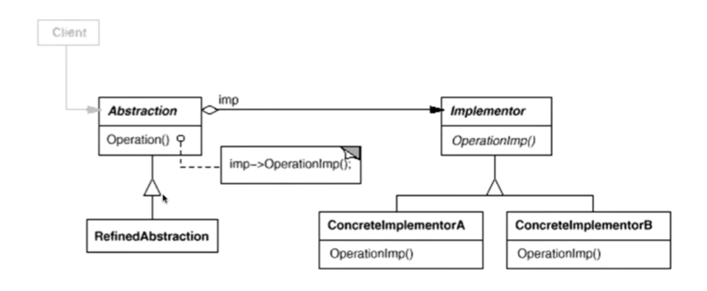

# 1.Brige桥模式

## 1.1 动机

由于某些类型的固有的实现逻辑，使得它们具有两个变化的维度，乃至多个维度的变化

如何应对这种多维度的变化？如何利用面向对象技术来使得类型可以轻松沿着两个乃至多个方向变化？而不引入额外的复杂度？

## 1.2 讲解

当一个抽象可能有多个实现时，通常用继承来协调它们。抽象类定义对该抽象的接口，而具体的子类用不同的方式实现。但是有时候此方法不够灵活，继承机制将抽象部分与它的实现部分固定在一起，使得难以对抽象部分和实现独立地进行修改，如下

```c++
class Message{
public:
    virtual void Login(string username, string password)=0;
    virtual void SendMessage(string message)=0;
    virtual void SendPicture(Image image)=0;
    
    virtual void PlaySound()=0;
    virtual void DrawShape()=0;
    virtual void WriteText()=0;
    virtual void Connect()=0;
    
    virtual ~Message(){}
};
```

Message接口定义了Message在不同平台和业务的抽象，然后在不同的平台进行具体的实现，看起来很正确，每个Message都要有这些东西

具体理解例如手机的消息，Apple的消息和Android的消息都有消息的窗口(DrawShape)，接受消息时的提示音(PlaySound),写下消息(WriteText)，发送消息后的连接(Connection)这些功能。发送消息、图片（Send Message，SendPicture）和登录(Login)这些功能

我们继续写下去

```c++
class PCMessageBase : public Message{
public:
    virtual void PlaySound() {/*实现*/}
    virtual void DrawShape() {/*实现*/}
    virtual void WriteText() {/*实现*/}
    virtual void Connect() {/*实现*/}
};

class MobileMessageBase : public Message{
public:
    virtual void PlaySound() {/*实现*/}
    virtual void DrawShape() {/*实现*/}
    virtual void WriteText() {/*实现*/}
    virtual void Connect() {/*实现*/}
};
```

在手机的和在PC端的Message显然不一样，都继承了Message来实现其平台的内容。

接下来，实现每个平台的Message的业务

```c++
class PCMessageLite : public PCMessageBase{
public:
    virtual void Login(string username, string password) {
        PCMessageBase::Connect();
        //...
    }
    virtual void SendMessage(string message) {
        PCMessageBase::WriteText();
        //...
    }
    virtual void SendPicture(Image image) {
        PCMessageBase::DrawShape();
        //...
    }
};

public MobileMessageLite : public MobileMessageBase {
    virtual void Login(string username, string password) {
        MobileBase::Connect();
        //...
    }
    virtual void SendMessage(string message) {
        MobileBase::WriteText();
        //...
    }
    virtual void SendPicture(Image image) {
        MobileBase::DrawShape();
        //...
    }
};
```

可能我们还需要给平台提供不同的服务

```c++
class PCMessagePerfer : public PCMessageBase{
public:
    virtual void Login(string username, string password) {
        PCMessageBase::PlaySound();
        //...
        PCMessageBase::Connect();
        //...
    }
    virtual void SendMessage(string message) {
        PCMessageBase::PlaySound();
        //...
        PCMessageBase::WriteText();
        //...
    }
    virtual void SendPicture(Image image) {
        PCMessageBase::DrawShape();
        //...
    }
};

class MobileMessagePerfer : public MobileMessageBase{
public:
    virtual void Login(string username, string password) {
        MobileBase::PlaySound();
        //...
        MobileBase::Connect();
        //...
    }
    virtual void SendMessage(string message) {
        MobileBase::PlaySound();
        //...
        MobileBase::WriteText();
        //...
    }
    virtual void SendPicture(Image image) {
        MobileBase::DrawShape();
        //...
    }
};
```

这时候我们发现，如果我们修改Message和，我们得修改1(Message)+n(PCMessgeBase+MobileMessageBase)+n*m(每个类的两个子类，共n\*m)个类

这代价太大了，所以我们需要优化以下，学完装饰模式，可以我们看到`PCMessageBase::Connection()`和`MobileMessageBase::Connection()`我们会想到利用组合和多态，然后合在一起

```c++
class PCMessageLite{
    //PCMessageBase *message;
    Message *message;//=new PCMessageBase()
public:
    virtual void Login(string username, string password) {
        message->Connect();
        //...
    }
    virtual void SendMessage(string message) {
        message->WriteText();
        //...
    }
    virtual void SendPicture(Image image) {
        message->DrawShape();
        //...
    }
};

public MobileMessageLite{
    //MobileMessageBase *message;
    Message *message;//=new MobileMessageBase;
    virtual void Login(string username, string password) {
        message->Connect();
        //...
    }
    virtual void SendMessage(string message) {
        message->WriteText();
        //...
    }
    virtual void SendPicture(Image image) {
        message->DrawShape();
        //...
    }
};
```

我们可能会想着这么写，但是这样有个问题，我们MobileMessageBase和PCMessageBase是个抽象类，因为它们没有完全实现Message接口，只是实现其中一部分，所以21行和3行是不成立的。所以我们没法用多态和组合来像装饰模式一样优化

其实我们会发现，这其实是因为Message接口设计不合理的问题，MessageBase只实现了其中四种，而对应的子类又是实现其中三种，这三种方法又用到父类实现的四种。也就是我们把其抽象部分和实现部分合在一起了。也就是这三种方法和四种方法不该存在于同一个抽象类Message

我们应该这样写

```c++
class Message{
public:
    virtual void Login(string username, string password)=0;
    virtual void SendMessage(string message)=0;
    virtual void SendPicture(Image image)=0;
       
    virtual ~Message(){}
}; 

class MessageImp{
    virtual void PlaySound()=0;
    virtual void DrawShape()=0;
    virtual void WriteText()=0;
    virtual void Connect()=0;
	
    virtual ~MessageImp(){}
};

```

则其他部分我们要跟着改

```c++
class PCMessageBase : public MessageImp{
public:
    virtual void PlaySound() {/*实现*/}
    virtual void DrawShape() {/*实现*/}
    virtual void WriteText() {/*实现*/}
    virtual void Connect() {/*实现*/}
};

class MobileMessageBase : public MessageImp{
public:
    virtual void PlaySound() {/*实现*/}
    virtual void DrawShape() {/*实现*/}
    virtual void WriteText() {/*实现*/}
    virtual void Connect() {/*实现*/}
};
```

```c++
class PCMessageLite : public Message{
    //PCMessageBase *message;
    MessageImp *message;//=new PCMessageBase()
public:
    virtual void Login(string username, string password) {
        message->Connect();
        //...
    }
    virtual void SendMessage(string message) {
        message->WriteText();
        //...
    }
    virtual void SendPicture(Image image) {
        message->DrawShape();
        //...
    }
};

public MobileMessageLite : public Message{
    //MobileMessageBase *message;
    MessageImp *message;//=new MobileMessageBase;
    virtual void Login(string username, string password) {
        message->Connect();
        //...
    }
    virtual void SendMessage(string message) {
        message->WriteText();
        //...
    }
    virtual void SendPicture(Image image) {
        message->DrawShape();
        //...
    }
};
```

所以我们可以将上面两个类合在一起

```c++
class MessageLite : public Message{
    //PCMessageBase *message;
    MessageImp *message;//=new PCMessageBase()
public:
    virtual void Login(string username, string password) {
        message->Connect();
        //...
    }
    virtual void SendMessage(string message) {
        message->WriteText();
        //...
    }
    virtual void SendPicture(Image image) {
        message->DrawShape();
        //...
    }
};

```

类似的Perfer类也可以这样操作

```c++
class MessagePerfer : public Message{
    MessageImp *message;
public:
    virtual void Login(string username, string password) {
        message->PlaySound();
        //...
        message->Connect();
        //...
    }
    virtual void SendMessage(string message) {
        message->PlaySound();
        //...
        message->WriteText();
        //...
    }
    virtual void SendPicture(Image image) {
        message->DrawShape();
        //...
    }
```

## 1.3 模式定义

将抽象部分(业务功能)与实现部分(平台实现)分离，使它们都可以独立变化

## 1.4 结构



## 1.5 要点总结

1. Bridge模式使用"对象间的组合关系"解耦了抽象和实现之间固有的绑定关系，使得抽象和实现可以沿着各自的维度来变化。所谓抽象和实现沿着各自纬度的变化，即“子类化”它们。
2. Bridge模式有时候类似于多继承方案，但是多继承方案往往违背单一职责原则(即一个类只有一个变化的原因)，复用性比较差。Bridge模式是比多继承方案更好的解决方法。
3. Bridge模式的应用一般在“两个非常强的变化维度”，有时一个类也有多于两个的变化维度，这时可以使用Bridge的扩展模式。
