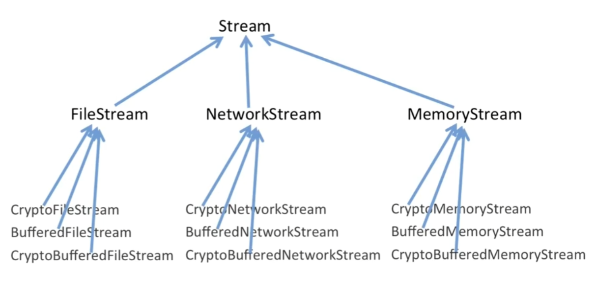
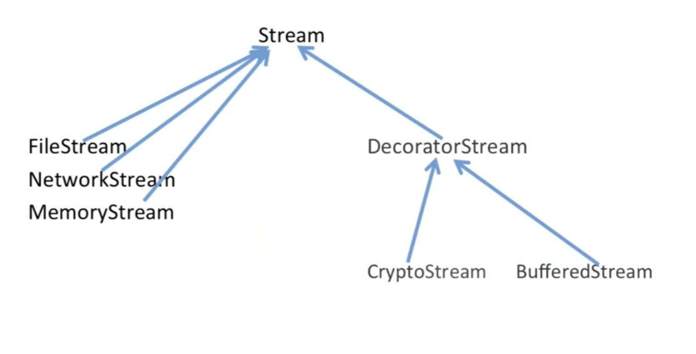
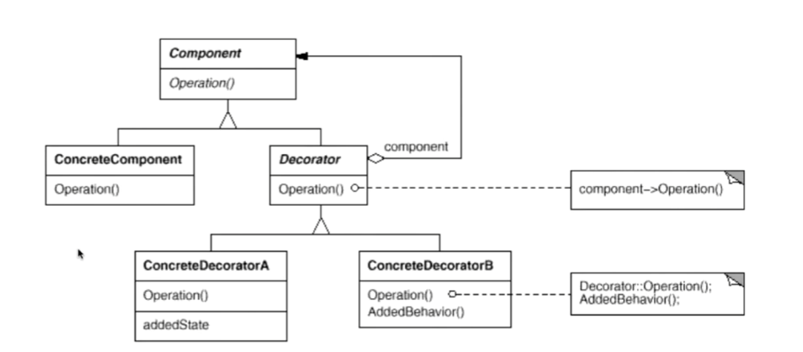

# 单一职责模式

在软件组件的设计中，如果责任划分的不清晰，使用继承得到的结果往往是随着需求的变化，子类急剧膨胀，同时充斥着重复代码，这时候的关键是划清责任

# 1.装饰模式

## 1.1动机

为某些情况下我们可能会”过度地使用继承来扩展对象的功能“，由于继承为类型引入的静态性质，使得这种拓展方式缺乏灵活性；并且随着子类的增多(拓展功能的增多)，各种子类的组合(拓展功能的组合)会导致更多子类的膨胀

如何使"对象功能的拓展"能够根据需要来动态的实现？同时避免"拓展功能的增多"带来子类膨胀问题？从而使得"功能拓展变化"导致的影响降为最低？

## 1.2 讲解

假如我们要写一个对流的操作，首先我们定义一个流的接口

```c++
class Stream {
public:
    virtual char Read(int numeber)=0;
    virtual void Seek(int position)=0;
    virtual void Write(char data)=0;
};
```

然后我们又有网络流，文件流，内存流，如下代码

```c++
class FileStream : public Stream {
public:
    virtual char Read(int number) {
        // 读文件流...
    }
    virtual void Seek(int position) {
        // 定位文件流
    }
    virtual void Write(int data) {
        // 写文件流
    }
};

class NetworkStream : public Stream {
public:
    virtual char Read(int number) {
        // 读网络流...
    }
    virtual void Seek(int position) {
        // 定位网络流
    }
    virtual void Write(int data) {
        // 写网络流
    }
};

class MemoryStream : public Stream {
public:
    virtual char Read(int number) {
        // 读内存流...
    }
    virtual void Seek(int position) {
        // 定位内存流
    }
    virtual void Write(int data) {
        // 写内存流
    }
};
```

如果我们要写一个对流的加密，可能会像下面的写法一样

```c++
class CryptoFileStream : public FileStream{
public:
    virtual char Read(int number) {
        // 额外的加密操作
        FileStream::Read(numnber);
        // 额外的加密操作
    }
    virtual void Seek(int position) {
        // 额外的加密操作
        FileStream::Seek(position);
        // 额外的加密操作
    }
    virtual void Write(int data) {
        // 额外的加密操作
        FileStream::Write(data);
        // 额外的加密操作
    }
};

class CryptoFileStream : public NetworkStream{
public:
    virtual char Read(int number) {
        // 额外的加密操作
        NetworkStream::Read(numnber);
        // 额外的加密操作
    }
    virtual void Seek(int position) {
        // 额外的加密操作
        NetworkStream::Seek(position);
        // 额外的加密操作
    }
    virtual void Write(int data) {
        // 额外的加密操作
        NetworkStream::Write(data);
        // 额外的加密操作
    }
};

class CryptoFileStream : public MemoryStream{
public:
    virtual char Read(int number) {
        // 额外的加密操作
        MemoryStream::Read(numnber);
        // 额外的加密操作
    }
    virtual void Seek(int position) {
        // 额外的加密操作
        MemoryStream::Seek(position);
        // 额外的加密操作
    }
    virtual void Write(int data) {
        // 额外的加密操作
        MemoryStream::Write(data);
        // 额外的加密操作
    }
};
```

观察上面的代码，我们发现其实对FileStream, NetworkStream和MemoryStream的加密过程都是一样的，唯一不同的是`FileStream::Read(number)`和`NetworkStream::Read(number)`这类代码。

这是因为继承的不当使用，错误的使用继承为我们引入了静态特性，也就是`FileStream::Read(number)`和`NetworkStream::Read(number)`，你必须为此指定是哪个类的`Read`操作。也就是说，我们应该使用组合来解决这个问题。如下

而且这样写代码还有一个问题,如下图



如果Stream接口发送一个改变，首先假设FileStream, NetworkStream和MemoryStream有n个变化，FileStream的子类有m个变化，由于子类可以有组合关系，那么将会有在Crypto所在的层次m!/2的变化，最后总共有1+n+(n * m!/2)的变化要改，m小的时候还有，m一大起来我们要付出的代价太大了

```c++
class CryptoFileStream {
    FileStream *stream;
public:
    virtual char Read(int number) {
        // 额外的加密操作
        stream->Read(numnber);
        // 额外的加密操作
    }
    virtual void Seek(int position) {
        // 额外的加密操作
        stream->Seek(position);
        // 额外的加密操作
    }
    virtual void Write(int data) {
        // 额外的加密操作
        stream->Write(data);
        // 额外的加密操作
    }
};

class CryptoFileStream{
    NetworkStream *stream
public:
    virtual char Read(int number) {
        // 额外的加密操作
        stream->Read(numnber);
        // 额外的加密操作
    }
    virtual void Seek(int position) {
        // 额外的加密操作
        stream->Seek(position);
        // 额外的加密操作
    }
    virtual void Write(int data) {
        // 额外的加密操作
        stream->Write(data);
        // 额外的加密操作
    }
};

class CryptoFileStream{
    MemoryStream *stream;
public:
    virtual char Read(int number) {
        // 额外的加密操作
        stream->Read(numnber);
        // 额外的加密操作
    }
    virtual void Seek(int position) {
        // 额外的加密操作
        stream->Seek(position);
        // 额外的加密操作
    }
    virtual void Write(int data) {
        // 额外的加密操作
        stream->Write(data);
        // 额外的加密操作
    }
};
```

我们可以发现，这三个类这样处理后长得差不多，事实上我们完全可以这样处理

```c++
class CryptoStream {
    Stream *stream;
public:
    virtual char Read(int number) {
        // 额外的加密操作
        stream->Read(numnber);
        // 额外的加密操作
    }
    virtual void Seek(int position) {
        // 额外的加密操作
        stream->Seek(position);
        // 额外的加密操作
    }
    virtual void Write(int data) {
        // 额外的加密操作
        stream->Write(data);
        // 额外的加密操作
    }
};
```

将三个类合并起来，然后`FileStream *stream`, `NetworkStream *stream`和`MemoryStream *stream`可以用`Stream* stream`来表示，因为这三个类都是Stream的子类，完全可以利用多态在运行时进行不同的处理

但这样又有一个问题，即是virtual的这些函数怎么来的？所以我们还需要继承Stream接口。

基于上面的代码和刚才的继承图，我们同样可以设计出BufferStream

```c++
class CryptoStream : public Stream {
    Stream *stream;
public:
    CryptoStream(Stream *stm) : stream(stm) {
        
    }
    virtual char Read(int number) {
        // 额外的加密操作
        stream->Read(numnber);
        // 额外的加密操作
    }
    virtual void Seek(int position) {
        // 额外的加密操作
        stream->Seek(position);
        // 额外的加密操作
    }
    virtual void Write(int data) {
        // 额外的加密操作
        stream->Write(data);
        // 额外的加密操作
    }
};

class BufferStream : public Stream {
    Stream *stream;
public:
    BufferStream(Stream *stm) : stream(stm) {
        
    }
    virtual char Read(int number) {
        // 额外的缓冲操作
        stream->Read(numnber);
        // 额外的缓冲操作
    }
    virtual void Seek(int position) {
        // 额外的缓冲操作
        stream->Seek(position);
        // 额外的缓冲操作
    }
    virtual void Write(int data) {
        // 额外的缓冲操作
        stream->Write(data);
        // 额外的缓冲操作
    }
};
```

接下来，两个类都有一个Stream的成员，我们应该往上提或者在此加一个中间类，但往父类提有个问题，Stream的子类不都使用Stream* stream这个成员。所以我们设置一个中间类

```c++
class DecoratorStream : public Stream {
protected:
    Stream* stream;
    DecoratorStream(Stream* stm) : stream(stm) {
        
    }
};

class CryptoStream : public DecoratorStream {
public:
    CryptoStream(Stream *stm) : DecoratorStream(stm) {
        
    }
    virtual char Read(int number) {
        // 额外的加密操作
        stream->Read(numnber);
        // 额外的加密操作
    }
    virtual void Seek(int position) {
        // 额外的加密操作
        stream->Seek(position);
        // 额外的加密操作
    }
    virtual void Write(int data) {
        // 额外的加密操作
        stream->Write(data);
        // 额外的加密操作
    }
};

class BufferStream : public DecoratorStream {
public:
    BufferStream(Stream *stm) : DecoratorStream(stm) {
        
    }
    virtual char Read(int number) {
        // 额外的缓冲操作
        stream->Read(numnber);
        // 额外的缓冲操作
    }
    virtual void Seek(int position) {
        // 额外的缓冲操作
        stream->Seek(position);
        // 额外的缓冲操作
    }
    virtual void Write(int data) {
        // 额外的缓冲操作
        stream->Write(data);
        // 额外的缓冲操作
    }
};
```

最后的继承图如下所示,Stream一个改变，File Stream，NetworkStream和MemoryStream有n个变化，CrypoStream和BufferStream，此时没有个组合，又不依赖三个Stream子类，所有只有m+1个改变。总共就只有1+n+(1+m)的改变



## 1.3 模式定义

动态（组合）地给一个对象增加一些额外地职责。就增加功能而言，Decorator模式比生成子类（继承）更为灵活（消除重复代码&减少子类个数）

## 1.4 结构



## 1.5 要点总结

1. 通过采用组合而非继承地方式，Decorator模式实现了在<u>运行时</u>动态拓展对象功能的能力，而且可以根据需要拓展多个功能。避免了使用继承带来的”灵活性差“和”多子类衍生问题“
2. **Decorator类在接口上表现为is-a Component的继承关系，但在实现上又变现为has-a Component的组合关系**（同时有is-a和has-a的时候，要考虑是不是用了decorator模式）
3. Decorator模式的目的并非为了解决”多子类衍生的多继承问题“，Decorator模式应用的要点在于解决”主体类在多个方向上的拓展功能“——是为”装饰“的含义

