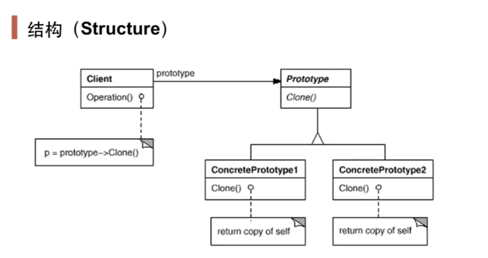

# 原型模式Prototype

## 1.1 动机

在软件系统中，经常面临着"**某些结构复杂的对象**"的创建工作；由于需求的变化，这些对象经常面临着剧烈的变化，但是它们却拥有**稳定一致的接口**

如何应对这种变化？如何向"客户程序(使用这些对象的程序)"隔离出"这些易变对象"，从而使得这些易变对象的客户程序"不需要随着需求改变而改变"

## 1.2 讲解

```c++
// 工厂的抽象
class SplitterFactory{
public:
    virtual ISplitter* CreateSplitter()=0;
    virtual ~SplitterFactory(){}
};
// 抽象类
class ISplitter{
public:
    virtual void split()=0;
    virtual ~ISplitter(){}
};
// 具体工厂
class BinarySplitterFacotry : public SplitterFactory{
public:
    virtual ISplitter* CreateSplitter(){
        return new BinarySplitter();
    }
};
class TxtSplitterFacotry : public SplitterFactory{
public:
    virtual ISplitter* CreateSplitter(){
        return new TxtSplitter();
    }
};
class VideoSplitterFacotry : public SplitterFactory{
public:
    virtual ISplitter* CreateSplitter(){
        return new VideoSplitter();
    }
};
class PictureSplitterFacotry : public SplitterFactory{
public:
    virtual ISplitter* CreateSplitter(){
        return new PictureSplitter();
    }
};
//具体类
class BinarySplitter : public ISplitter{};
class TxtSplitter : public ISplitter{};
class PitureSplitter : public ISplitter{};
class VideoSplitter : public ISplitter{};

// 客户程序
class MainForm : public Form{
	SplitterFactory* factory;
public:
	MainForm(SplitterFactory* factory){
		this->factory = factory;
	}

    void Button1_click(){
        ISplitter* splitter = factory->CreateSplitter();//多态new
        splitter->split();
    }
};
```

我们可以对抽象类进行一些改变

```c++
// 抽象类
class ISplitter{
public:
    virtual void split()=0;
    virtual ISplitter* clone()=0;//原来是CreateSplitter()
    virtual ~ISplitter(){}
};

//具体类
class BinarySplitter : public ISplitter{
public:
    ISplitter* clone(){
        return new BinarySplitter(*this);//使用拷贝构造函数
    }
};
class TxtSplitter : public ISplitter{
public:
    ISplitter* clone(){
        return new TxtSplitter(*this);
    }
};
class PitureSplitter : public ISplitter{
public:
    ISplitter* clone(){
        return new PitureSplitter(*this);
    }
};
class VideoSplitter : public ISplitter{
public:
    ISplitter* clone(){
        return new VideoSplitter(*this);
    }
};

// 客户程序
class MainForm : public Form{
	ISplitter* prototype;
public:
	MainForm(ISplitter* prototype){
		this->prototype = prototype;
	}

    void Button1_click(){
        ISplitter* splitter = prototype->clone();//克隆原型
        splitter->split();
    }
};
```

这样，当你对象达到某个状态时，你就能通过clone把对象的状态通过拷贝构造函数取出来并返回，而不是在每一次用Factory创建一个对象后再想方设法的达到你要的状态，甚至在这个过程中无法达到的这个状态。而用原型模式，只要达到了一个状态，以后的使用就直接clone它就行了

也就是说，当你创建一个对象时，如果要考虑复杂的中间状态时，考虑的应该是原型模式。如果只是简单的创建一个对象，那么工厂模式更好

## 1.3 模式定义

 使用原型实例指定创建对象的种类，然后通过拷贝这些原型来创建新的对象

## 1.4 结构



## 1.5 要点总结

1.  prototype模式同样用于隔离类对象的使用者和具体类型之间的耦合关系，它同样要求这些"易变类"具有"稳定的接口"
2. prototype模式对于"如何创建易变类的实体对象"采用"原型克隆"的方法，使得我们可以非常灵活地动态创建"具有某些稳定接口"的新对象——所需工作仅仅是注册一个新类的对象(原型)，然后在任何需要的对象clone
3. prototype模式中的clone方法可以利用某些框架中的序列化来实现深拷贝
