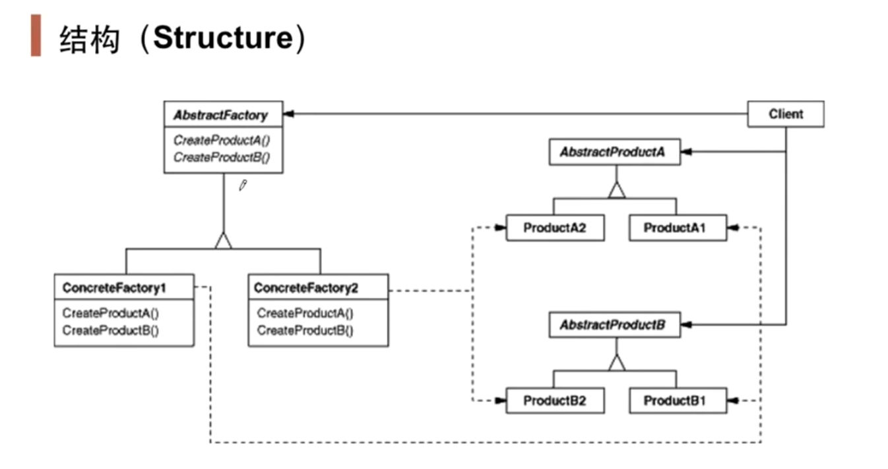

# 抽象工厂Abstract Factory

## 1.1 动机

在软件系统中，经常面临着“**一系列**相互依赖的对象”的创建工作“；同时，由于需求的变化，往往存在更多系列对象的创建工作

## 1.2 讲解

```c++
class EmployeeDao{
public:
	vector<EmployeeD0> GetEmployees(){
		SqlConnection* connection = new SqlConnection();
		SqlCommand* command = new SqlCommand();
		//......
	}
};
```

在上面的代码中，SqlConnection是面对Sql Server的Connection对象，这样的紧耦合不适应于变化，如果由于需求我们要换数据库为MySQL，我们得对EmployeeDao进行修改，所以首先基于”面向接口编程“的思想，我们可以进行一些改动

```c++
// 接口
class IDBConnection{};
class IDBCommand{};
// SqlServer
class SqlConnection : public IDBConnection{};
class SqlCommand : public IDBCommand{};
// Oracle
class OracleConnnection : public IDBConnection{};
class OracleCommand : public IDBCommand{};

class EmployeeDao{
public:
	vector<EmployeeD0> GetEmployees(){
		IDBConnection* connection = new SqlConnection();
		IDBCommand* command = new SqlCommand();
		//......
	}
};
```

改变后，我们还剩下new的问题，不然EmployeeDao还是依赖于具体类，所以我们使用Factory Method模式来解决这个问题

```c++
// 接口
class IDBConnection{};
class IDBConnectionFactory{
public:
    virtual IDBConnection* CreateDBConnection()=0;
    virtual ~IDBConnectionFactory(){}
};
class IDBCommand{};
class IDBCommandFactory{
public:
    virtual IDBCommand* CreateDBCommand()=0;
    virtual ~IDBCommandFactory(){}
};
// SqlServer
class SqlConnection : public IDBConnection{};
class SqlConnectionFactory : public IDBConnectionFactory{};
class SqlCommand : public IDBCommand{};
class SqlCommandFactory : public IDBCommandFactory{};
// Oracle
class OracleConnnection : public IDBConnection{};
class OracleConnectionFactory : public IDBConnectionFactory{};
class OracleCommand : public IDBCommand{};
class OracleCommandFactory : public IDBCommandFactory{};

class EmployeeDao{
    IDBConnectionFactory* dbConnectionFactory;
    IDBCommandFactory* dbCommandFactory;
public:
	vector<EmployeeD0> GetEmployees(){
		IDBConnection* connection 
            = dbConnectionFactory->CreateConnection();
		IDBCommand* command = dbCommandFactory->CreateCommand();
		//......
	}
};
```

这个时候我们的EmployeeDao就不依赖于任何具体类了，dbConnectionFactory指向SqlConnectionFactory，CreateConnection就返回SqlConnection的对象，dbConnectionFactory指向OracleConnectionFactory，CreateConnection就返回OracleConnection对象

但是此时还有一个问题，那就是，我们的**Connection和Command是有关联的**，一般不可能connection是连接的SqlServer的数据库，而Command却是对Oracle的操作。所以我们这时候就使用另一种叫做"Abstract Factory"模式，如下

```c++
// 接口
class IDBConnection{};
class IDBCommand{};
class IDBFactory{
public:
    virtual IDBConnection* CreateDBConnection()=0;
    virtual IDBCommand* CreateDBCommand()=0;
    virtual ~IDBConnectionFactory(){}
};
// SqlServer
class SqlConnection : public IDBConnection{};
class SqlDBFactory : public IDBFactory{};
class SqlCommand : public IDBCommand{};
// Oracle
class OracleConnnection : public IDBConnection{};
class OracleDBFactory : public IDBFactory{};
class OracleCommand : public IDBCommand{};

class EmployeeDao{
    IDBFactory* dbFactory;
public:
	vector<EmployeeD0> GetEmployees(){
		IDBConnection* connection 
   = dbFactory->CreateConnection();
		IDBCommand* command = dbFactory->CreateCommand();
		//......
	}
};
```

将有关联的工厂集合在一个抽象类中，这样IDBFactory*指向SqlDBFactory时，所创建的Connection和Command对象就是同属于对SQL Server的操作了

## 1.3 模式定义

提供一个接口，让该接口负责创建一系列”相关或者相互依赖的对象“，无需指定它们具体的类

## 1.4 结构



## 1.5 要点总结

1. "系列对象"指的是在某一特定系列下的对象之间有相互依赖、或作用的关系。不同系列的对象之间不能相互依赖
2. Abstract Factory模式主要在于应对"新系列"的需求变动。其缺点在于难以应对"新对象"的需求变动，例如对IDBFactory添加一个新的接口
3. 如果没有应对"多系列对象创建"的需求变化，则完全没有必要使用Abstract Factory模式，这时候使用简单的工厂完全可以
