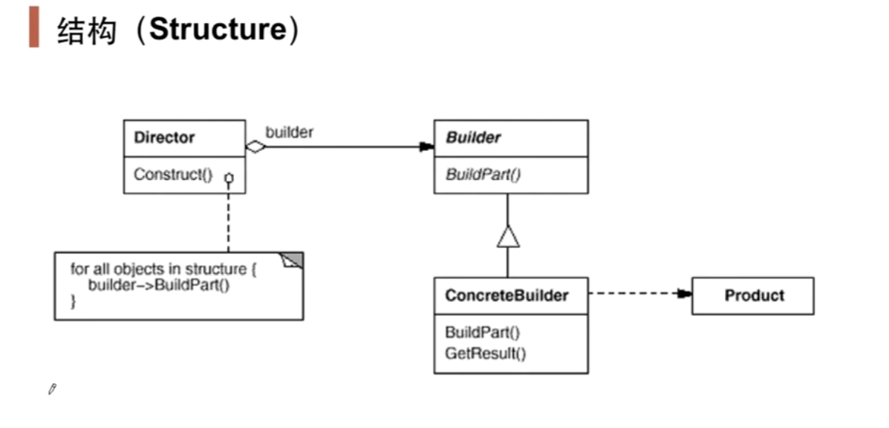

# 构建器Builder

## 1.1 动机

在软件系统中，有时候面临着"一个复杂对象"的创建工作，其通常由各个部分的子对象用一定的算法构成；由于需求的变化，这个复杂对象的各个部分经常面临剧烈的变化，但是它们组合在一起的算法却相对稳定。

如何应对这种变化？如何提供一种"封装机制"来隔离出"复杂对象的各个部分"的变化，从而保持系统的"稳定构建算法"不随着需求的变化而变化

## 1.2 讲解

```c++
class House{
public:
    void Init(){
        this->BuildPart1();
        //各种处理...
        this->BuildPart2();
        this->BuildPart3();
        this->BuildPart4();
        this->BuildPart5();
    }
protected:
    virtual void BuildPart1()=0;
    virtual void BuildPart2()=0;
    virtual void BuildPart3()=0;
    virtual void BuildPart4()=0;
    virtual void BuildPart5()=0;
};
```

这就是最简单的Builder了。在这个类House中，House的各个BuildPart的实现可以有很多种，但是它们的构建却在Init中很稳定。举个例子就是，House都是由Window，Door之类的组成，但每个House的Window和Door的实现可能都不同。

我们可以对House进行拓展，如下

```c++
class House{
public:
    void Init(){
        this->BuildPart1();
        //各种处理...
        this->BuildPart2();
        this->BuildPart3();
        this->BuildPart4();
        this->BuildPart5();
    }
protected:
    virtual void BuildPart1()=0;
    virtual void BuildPart2()=0;
    virtual void BuildPart3()=0;
    virtual void BuildPart4()=0;
    virtual void BuildPart5()=0;
};

class StoneHouse : public House{
protected:
    virtual void BuildPart1(){/*实现*/}
    virtual void BuildPart2(){/*实现*/}
    virtual void BuildPart3(){/*实现*/}
    virtual void BuildPart4(){/*实现*/}
    virtual void BuildPart5(){/*实现*/}   
};

int main(){
    House* pHouse = new StoneHouse();
    pHouse->Init();//Builder
}
```

在这里，House的Init也就是对象的构建和其实现（各种BuildPart）分离，这样在main中的pHouse指向不同对象时，Init出来的对象也就不同。实现同样的构建过程（Init里的步骤）创建不同的表示（StoneHouse实现的BuildPart）

但是，当一个类的构建过程十分的臃肿时，我们需要将对象的构建(也就是Init)抽出来。如下

```c++
class House{
    // 对象的表示
};

class HouseBuilder{
public:
    House* GetResult(){
        return pHouse;
    }
    virtual ~HouseBuilder(){}
protected:
    House* pHouse;
    virtual void BuildPart1()=0;
    virtual void BuildPart2()=0;
    virtual void BuildPart3()=0;
    virtual void BuildPart4()=0;
    virtual void BuildPart5()=0;
};

class StoneHouse : public House{};

class StoneHouseBuilder : public HouseBuilder{
protected:
    virtual void BuildPart1(){/*实现*/}
    virtual void BuildPart2(){/*实现*/}
    virtual void BuildPart3(){/*实现*/}
    virtual void BuildPart4(){/*实现*/}
    virtual void BuildPart5(){/*实现*/}   
};

class HouseDirector {
public:
    HouseBuilder* pHouseBuilder;
    
    HouseDirector(HouseBuilder* pHouseBuilder){
        this->pHouseBuilder = pHouseBuilder;
    }
    
    House* Construct(){ // Init
        pHouseBuilder->BuildPart1();
        //各种处理...
        pHouseBuilder->BuildPart2();
        pHouseBuilder->BuildPart3();
        pHouseBuilder->BuildPart4();
        pHouseBuilder->BuildPart5();
        return pHouseBuilder->GetResult();
    }
};

int main(){
    HouseBuilder* pHouseBuilder = new StoneHouseBuilder();
    HouseDirector houseDirector = new HouseDirector(pHouseBuilder);
    House* pHouse = houseDirector->Construct();
}
```


## 1.3 模式定义

将一个复杂对象的构建与其表示分离，使得同样的构建过程可以创建不同的表示

## 1.4 模式结构



## 1.5 要点总结

1. Builder模式主要用于"分步骤构建一个复杂的对象"。在这其中"分步骤"是一个稳定的算法，而复杂对象的各个部分则经常变化
2. 变化点在哪里，封装哪里——Builder模式主要在于应对"复杂对象各个部分"的频繁需求变化。其缺点在于难以应对"分步骤构建算法"的需求变动
3. 在Builder模式中，要注意不同语言中构造器内调用虚函数的差别(C++和Java等)
