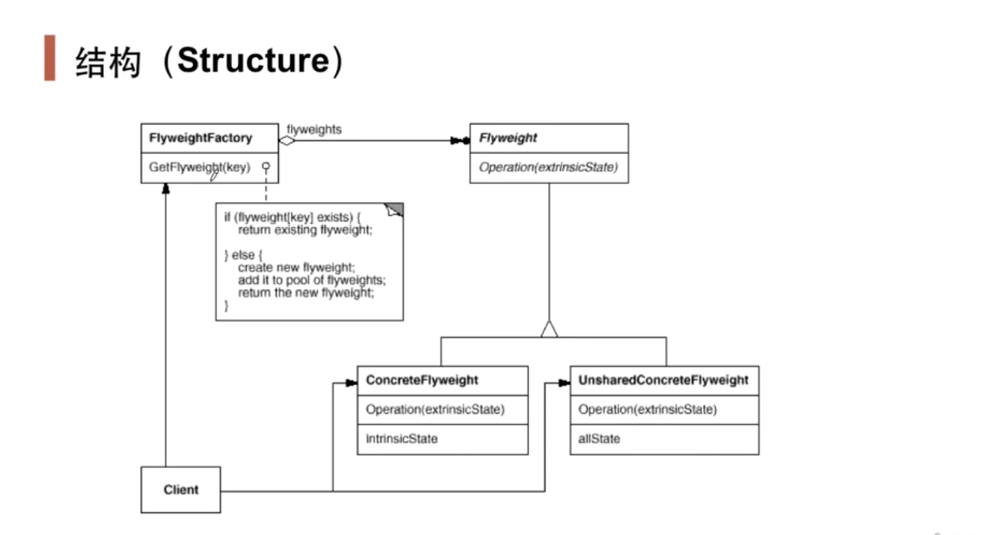

# 享元模式Flyweight

## 1.1 动机

在软件系统采用**纯粹对象方案**的问题在于大量细粒度的对象会很快充斥在系统中，从而带来很高的运行时代价——主要指内存需求方面的代价

如何避免大量细粒度对象问题的同时，让外部客户程序仍然能够透明地使用面向对象的方式来进行操作？

## 1.2 讲解

对于下面的代码

```c++
class Font{
private:
    string key;
public:
    Font(const string& key){
        //...
    }
};
```

在Font类中，如果对于一个文本文件，每个字符都创建一个Font的话开销未免太大，十万个字符就有十万个这样的Font对象，而可能仅仅就用了四五种字体。

这时候我们就应该用享元模式来设计，比如每种字体都有它的一个key(字体名)，然后使用这个key就能load到这个字体相关的资源，而不是每次都去创建一个对象。

```c++
class Font{
private:
    string key;
public:
    Font(const string& key){
        //...
    }
};

class FontFactory{
private:
    map<string, Font*> fontPool;
public:
    Font* GetFont(const string& key){
        map<string, Font*>::iterator item = fontPool.find(key);
        if(item != fontPool.end()){
            return fontPool[key];
        }else{
            Font *font = new Font(key);
            fontPool[key] = font;
            return font;
        }
    }
    
    void clear(){
        ...
    }
};
```

像上面进行处理后，我们一个文本文件如果有十万个字，那么不会出现十万个Font对象，而是只会有四五种字体。因为如果这类字体我们之前使用过，我们完全是可以在fontPool中找到并返回，然后直接对该对象load我们需要的资源。

因为对象要共享，所以一般建议只提供读的操作。不然容易某一次的对对象的操作影响所有使用该对象的代码

## 1.3 模式定义

运用**共享**技术有效地支持大量细粒度的对象

## 1.4 结构



## 1.5 要点总结

1. 面向对象很好的解决了抽象性问题，但是作为一个运行在机器中的程序实体，我们需要考虑对象的代价问题。FlyWeight主要解决面向对象代价问题，**一般不触及面向对象的抽象性问题**
2. FlyWeight采用**对象共享**的做法来降低系统中对象的个数，从而降低细粒度对象带给系统的压力。在具体实现方面，要注意对象状态的处理
3. 对象数量太大从而导致对象内存开销大——什么数量才算大？这需要我们仔细的根据具体应用情况进行评估，而不能凭空臆断