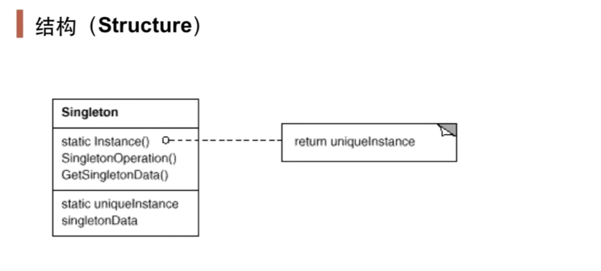

# 对象性能模式

面向对象很好地解决了"抽象"问题，但是必不可免地要付出一定的代价。对于通常情况来讲，面向成本大都可以忽略不计。但是某些情况，面向对象所带来的成本必须谨慎处理。

## 1.1 动机

在软件系统中，经常有一些特殊的类，必须保证它们在系统中只存在一个实例，才能保证它们的逻辑正确性、以及良好的效率

如何绕过常规的构造器，提供一种机制来保证一个类只有一个实例？虽然类的使用者可以在编写代码的时候自己处理。但是这应该是类设计者的责任

## 1.2 讲解

下面是一个最初版本的Singleton模式的代码

```c++
class Singleton{
public:
    Singleton()=delete;
    Singleton(const Singleton&)=delete;
    static Singleton* getInstance();
    static Singleton* m_instance;
};

Singleton* Singleton::m_instance = nullptr;

Singleton* Singleton::getInstance(){
    if(m_instance == nullptr){
        m_instance = new Singleton();
    }
    return m_instance;
}
```

在以上的版本中，`getInstance()`有个问题就是线程不安全。单线程情况下能正常运行。但在多线程环境下，如果线程A进入第13行后，线程B被调度，这时候`m_instance`还是nullptr，那么线程B仍然能进入第13行。那么两个线程完成后，全局就有两个Singleton实例了，违背了Singleton模式的初衷了。

我们可以用锁机制来改进这个问题

```c++
class Singleton{
public:
    Singleton()=delete;
    Singleton(const Singleton&)=delete;
    static Singleton* getInstance();
private:
    std::mutex m_mutex;
    static Singleton* m_instance;
};

Singleton* Singleton::m_instance = nullptr;
std::mutex Singleton::m_mutex;

Singleton* Singleton::getInstance(){
    std::lock_guard<std::mutex> lock(m_mutex);
    if(m_instance == nullptr){
        m_instance = new Singleton();
    }
    return m_instance;
}
```

虽然这样子实现了线程安全，但是以上实现有个问题，锁机制的代价太高了。这样子如果有很多读操作情况下，由于锁机制的自旋会影响性能，但读操作过程是不需要进行锁机制的保护的。所以我们对这个函数继续改变，使用双检查锁来进行优化

```c++
Singleton* Singleton::getInstance(){
    if(m_instance == nullptr){
    	std::lock_guard<std::mutex> lock(m_mutex);
    	if(m_instance == nullptr){
        	m_instance = new Singleton();
    	}
    }
    return m_instance;
}
```

以上实现很好的解决了读操作过程中锁机制带来的性能问题。这样只要`m_instance`不是nullptr，那么就只会直接返回一个现有的实例。而不会进入锁机制的判断。

但上述代码还有一个问题，那就是在编译器对代码优化过程中，翻译后的汇编指令通常顺序不和我们编写的代码一样。例如`m_instance = new Singleton()`这条代码，通常情况下，都是先给m_instance分配内存，调用Singleton()构造器，然后地址赋值。但实际情况下，却有可能是这样子的：先调用构造器，然后地址赋值，最后给m_instance分配内存。

在上述代码中，如果编译器是先给`m_instance`分配内存，然后`return m_instance`，最后才是调用构造器的话，返回值的结果可能是不正确的。也就是reorder不安全。为此我们需要告诉编译器，这段代码不要进行一个reorder的优化。在Java等语言中，我们可以对m_instance变量声明为一个`volatile`，而c++在11标准后，我们可以像如下处理

```c++
std::atomic<Singleton*> Singleton::m_instance;
std::mutex Singleton::m_mutex;
Singleton* Singleton::getInstance(){
    Singleton* tmp = m_instance.load(std::memory_order_relaxed);
    std::atomic_thread_fence(std::memory_order_acquire);//获取内存fence
    if(tmp == nullptr){
        std::lock_guard<std::mutex> lock(m_mutex);
        tmp = m_instance.load(std::memory_order_relaxed);
        if(tmp == nullptr){
            tmp = new Singleton();
            std::atomic_thread_fence(std::memory_order_release);
            m_instance.store(tmp, std::memory_order_relaxed);
        }
    }
    return tmp;
}
```

这样，第5行代码执行后，直到第11行执行完之前，tmp有关的代码都不能进行reorder优化。也就是reorder安全和线程安全全部得到保证

## 1.3 模式定义

保证一个类仅有一个实例，并提供一个该实例的全局访问点

## 1.4 结构



## 1.5 要点总结

1. Singleton模式的实例构造器可以设置为protected以允许子类派生
2. Singleton模式一般不要支持拷贝构造函数和Clone接口，因为这可能导致多个对象实例，与Singleton模式的初衷违背
3. 如何实现多线程下安全的Singleton？注意对双检查锁的正确实现