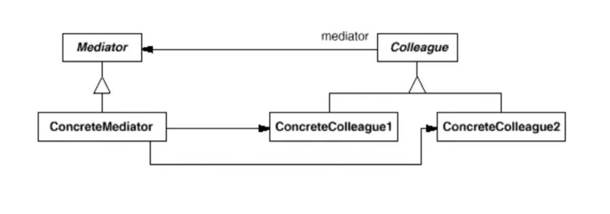

# 中介者模式Mediator

## 1.1 动机

在软件构建过程中，经常会出现**多个对象互相关联交互**的情况，对象之间常常会维持一种复杂的引用关系，如果遇到一些需求的更改，这种直接引用关系将面临不断的变化

虽然将一个系统分割成许多对象通常可以增加可复用性，但是对象间的相互连接的激增又会降低其可复用性。大量相互连接使得一个对象似乎不太可能在没有其他对象的支持下工作——系统表现为一个不可分割的整体。而且，任何对系统的性为进行较大的改动都十分困难，因为行为被分布在许多对象中。结果是，你可能不得不定义很多子类以定制系统的行为

在这种情况下，我们可使用一个"中介对象"来管理对象见的关联关系，避免相互交互的对象之间的紧耦合关系，从而更好的抵御变化

## 1.2 讲解

例如，对话框中的窗口组件间存在依赖关系。如按钮、菜单和输入等。这些依赖关系如果都用生成子类的办法来定制会很冗长，我们可以通过将集体行为封装在一个**中介者(mediator)**，中介者负责控制和协调一组对象间的交互

```c++
class DialogDirector{
public:
    virtual ~DialogDirector();
    
    virtual void ShowDialog();
    virtual void WidgetChanged(Widget*)=0;
protected:
    DialogDirector();
    virtual void CreateWidgets()=0;
};
```

`DialogDirector`为一个中介者接口，为具体的中介者提供行为的抽象，两个纯虚函数`WidgetChanged`发生在窗口发生变化时，`CreateWidgets`发生在创建新窗口时

```c++
class Widget{
public:
    Widget(DialogDirector*);
    virtual void Changed();
    
    virtual void HandleMouse(MouseEvent& event);
    //...
protected:
    DialogDirector* _director;
};

void Widget::Changed() {
    _director->WidgetChanged(this);
}
```

```c++
class ListBox : public Widget{
public:
    ListBox(DialogDirector* director) {
        Widget::Widget(director);
        //...
    }
    
    virtual const char* GetSelection();
    virtual void SetList(List<char*>* listItems);
    virtual void HandleMouse(MouseEvent& event);
	//...
};

class EntryField : public Widget{
    EntryFeild(DialogDirector* director) {
        Widget::Widget(director);
        //...
    }
    
    virtual void SetText(const char* text);
    virtual const char* GetText();
    virtual void HandleMouse(MouseEvent& event);
    //...
};
```

```c++
class Button : public Widget{
    Button(DialogDirector* director) {
        Widget::Widget(director);
        //...
    }
    
    virtual void SetText(const char* text);
    virtual void HandleMouse(MouseEvent& event);
    //...
};

void Button::HandleMouse(MouseEvent& event) {
    //...
    Changed();
}
```

在Widget，以及Widget衍生三个具体类的Button，ListBox和EntryField都维护一个DIalogDirector的对象，以便能够访问中介者。

然后每个类的对象和另一个类的对象通信时，与它的中介者通信。这样将每个类的依赖关系转移到与类与中介者的依赖，从而减少了多个具体类的耦合，使得该系统更具有鲁棒性

在这里，注意因为DialogDirector对象是protected的，所以public继承后一并继承过来，所以Widget子类不需要额外定义

```c++
class FontDialogDirector : public DialogDirector{
public:
    FontDialogDirector();
    virtual ~FontDialogDirector();
    virtual void WidgetChanged(Widget*);
protected:
    virtual void CreateWidgets();
private:
    Button *_ok;
    Button *_cancel;
    ListBox *_fontList;
    EntryField *_fontName;
};

void FontDialogDirector::CreateWidgets() {
    _ok = new Button(this);//this为FontDialogDirector类
    _cancel = new Button(this);
    _fontList = new FontList(this);
    _fontName = new EntryField(this);
}

void FontDialogDirector::WidgetChanged(Widget* theChangedWidget) {
    if(theChangedWidget == _fontList) {
        _fontName->SetText(_fontList->GetSelection());
    }else if(theChangedWidget == _ok) {
        //...
    }else if(theChangedWidget == _cancel){
        //...
    }
}
```

最后通过中介所的一个具体中介者也就是FontDialogDirector，管理对象见的关联关系，并且一个具体的中介者需要了解并维护使用中介者的对象。

在这里，我们在WidgetChanged里对对象间的关联进行管理。而我们抽象出一个DialogDirector也是为了Button，EntryField和ListBox不直接使用FontDialogDirector，通过多态将编译时的依赖转移到运行时。从而对其解耦合

## 1.3 模式定义

用一个中介者来封装一系列对象交互。中介者使各对象不需要显示的相互依赖（编译时依赖->运行时依赖），从而使其耦合松散(管理变化)，从而可以独立地改变它们之间地交互

## 1.4 结构



## 1.5 要点总结

1. 将多个对象间复杂关系的关联关系解耦，Mediator模式将多个对象间的控制逻辑进行集中管理，变"多个对象相互关联"为"多个对象和一个中介者关联"，简化了系统的维护，抵御了可能的变化
2. 随着控制逻辑的复杂化，Mediator具体对象的实现可能相当复杂。这时候可以对Mediator进行分解处理
3. Facade模式是解耦系统(单向)的对象关联方式；Mediator模式是解耦系统内各个对象间(双向)的关联关系