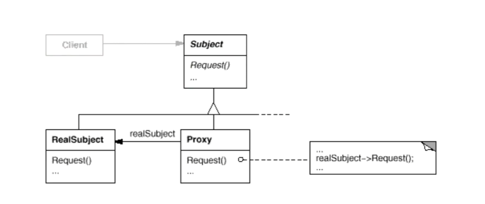

# Proxy代理模式

## 1.1 动机

在面向对象系统中，有些对象由于某种原因(比如对象创建的开销很大，或者某些操作需要安全控制，或者需要进程外访问等)，直接访问会给使用者、或者系统结构带来很多麻烦

如何在不失去透明操作对象的同时来管理/控制这些对象特有的复杂性？增加一层间接层是软件开发中常见的解决方式

## 1.2 讲解

例如，如果我们要实现一个可以嵌入图像对象的文档编辑器。

有些图形对象的创建开销很大，但是打开文档必须很迅速，因此我们在打开文档时应避免一次性创建所有开销很大的对象。而这些对象在文档中也不都是同时可见的，所以也没必要同时创建这些对象，而是当一个图象变为可见时才来创建这类对象。

```c++
class Graphic {
public:
    virtual ~Graphic();
    
    virtual void Draw(const Point& at)=0;
    virtual void HandleMouse(Event& event)=0;
    
    virtual const Point* GetExtent()=0;
    
    virtual void Load(istream& from)=0;
    virtual void Save(ostream& to)=0;
protected:
    Graphic();
};
```

```c++
class Image : public Graphic{
public:
    Image(const char* file);
    virtual ~Image();
    
    virtual void Draw(const Point& at);
    virtual void HandleMouse(Event& event);
    
    virtual const Point* GetExtent();
    
    virtual void Load(istream& from);
    virtual void Save(ostream& to);
private:
    ......
};
```

```c++
class ImageProxy : public Graphic{
public:
    Image(const char* file);
    virtual ~Image();
    
    virtual void Draw(const Point& at);
    virtual void HandleMouse(Event& event);
    
    virtual const Point* GetExtent();
    
    virtual void Load(istream& from);
    virtual void Save(ostream& to);
protected:
    Image* GetImage();
private:
    Image* _image;
    Point _extent;
    char* _fileName;
};
```

可以看到，ImageProxy和Image都实现了Graphic的接口，然后ImageProxy里有个Image的对象。

```c++
Image* ImageProxy::GetImage() {
    if(_image == 0){
		_image = new Image(_fileName);
    }
    return _image;
}

void ImageProxy::Draw(const Point& at){
    GetImage()->Draw(at);	//调用Image的Draw
}

const Point& ImageProxy::GetExtent(){
    if(_extent == Point::Zero){
        _extent = GetImage()->GetExtent();
    }
}

void ImageProxy::HandleMouse(Event& event){
    GetImage()->HandleMouse(event);
}

void ImageProxy::Save(ostream& to) {
	to << _extent << _fileName;
}

void ImageProxy::Load(istream& from){
    from >> _extent >> _fileName;
}
```

ImageProxy通过对自己类里的image操作，对客户程序隐藏了image的处理过程。之后对Image的一切操作都通过ImageProxy来进行，如下

```C++
class TextDocument{
public:
    TextDocment();
    void Insert(Graphic*);
    ......
};

TextDocument* text = new TextDocument;
//....
//通过ImageProxy来操作Image对象
text->Insert(new ImageProxy("anImageFileName"));
```

## 1.3 适用性

1. 远程代理(remote proxy)：负责对请求及其参数进行编码，并向不同地址空间中的实体发送已编码的请求
2. 虚代理(virtual proxy)：可以缓存实体的附加信息，以便延迟对它的访问
3. 保护代理(protection proxy)：检查调用者是否具有实现一个请求所必需的访问权限
4. 智能指引(smart reference)：取代简单的指针，他在访问对象时执行一些附加操作

## 1.4 结构



## 1.5 要点总结

1. "增加一层间接层"是软件系统中对许多复杂问题的一种常见解决方案。在面向对象中，直接使用某些对象会带来很多问题，作为间接层的proxy对象便是解决这一问题的常用手段
2. 具体proxy设计模式的实现方法、实现粒度相差很大、有些可能对单个对象做细粒度的控制，如copy-on-write技术，有些可能组件模块提供抽象代理层，在架构层次对对象做proxy
3. Proxy并不一定要求保持接口完整的一致性，只要能够实现间接控制，有时候损及一些透明性是可以接受的

## 1.6 和装饰器模式的区别

1. 装饰模式的功能实现是由上层调用者决定的，而代理模式的功能已经写死了，不能够实现灵活的拓展
2. 两者都是对类的方法进行增强，但装饰器模式强调的是增强自身，在被装饰之后你能够够在被增强的类上使用增强后的方法。增强过后还是你，只不过能力变强了。而代理模式则强调要别人帮你去做一些本身与你业务没有太多关系的职责。代理模式是为了实现对象的控制，因为被代理的对象往往难以直接获得或者是其内部不想暴露出来
3. 代理模式最终客户端调用的是代理类，是通过代理类去操作原对象，而装饰器模式最终客户端调用的还是原对象

