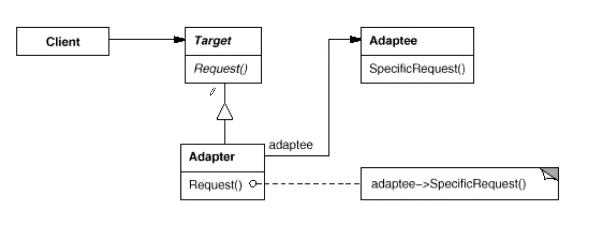

# 适配器Adapter

## 1.1 动机

在软件系统中，由于应用环境的变化，常常需要将"一些现存的对象"放在新的环境中应用，但是新环境要求的接口是这些现存对象所不满足的

如何应对这种"迁移的变化"?如何既能利用现有对象的良好实现，同时又能满足新的应用环境所要求的新接口？

## 1.2 讲解

```c++
class ITarget{
public:
    virtual void process()=0;
};

class IAdaptee{
public:
    virtual void foo(int data)=0;
    virtual int bar()=0;
}

class Adapter : public ITarget{
protected:
    IAdaptee* pAdaptee;
public:
    Adapter(IAdaptee* pAdaptee){
        this->pAdaptee = pAdaptee;
    }
    
    virtual void process(){
        // 在新的接口里使用老的接口
        int data = pAdaptee->bar();
        pAdaptee->foo(data);
        //...各种处理
    }
}
```

这样通过继承新的接口，组成老的接口，在新的接口的实现里处理老的接口，实现老接口与新接口的适配。使用如下

```c++
class OldClass : public IAdaptee{
	//....
};

int main() {
    IAdaptee* pAdaptee = new OldClass();
    ITarget* pTarget = new Adapter(pAdaptee);//适配
    pTarget->process();
}
```

上面继承+组合的放在在《设计模式——可复用面向对象软件的基础》称为对象适配器，但书里里还定义了一种叫"类适配器"的适配器。即是全部通过继承来实现，一般是public继承一个Target接口，private继承一个Adaptee接口，有如下形式

```c++
class Adapter : public ITarget, private IAdaptee{
    //....
};
```

但是这样的话有个问题，我们怎么把`OldClass`传进去？所以我们像下面的写法写

```c++
class Adapter : public ITarget, private OldClass{
    //...
}
```

但这样写的话有另一个问题，Adapter类依赖于一个具体类，这样不利于未来我们进行拓展。

而使用对象适配器，我们可以在Adapter中放一个IAdaptee的抽象类，然后通过多态实现具体类和Adapter的松耦合

**所以现实中我们一般都是用对象适配器而不是类适配器**

## 1.4 结构



## 1.5 要点总结

1. Adapter模式主要应用于"希望复用一些现存的类，但是接口又与复用环境要求不一致的情况"，在遗留代码复用、类库迁移等方面非常有用
2. GoF 23定义了两种Adapter模式的实现结构：对象适配器和类适配器。但类适配器采用"多继承"的实现方式，一般不推荐使用。对象适配器采用"对象组合"的方式，更符合松耦合精神
3. Adapter模式可以实现得非常灵活，不必拘泥于GoF23中定义的两种结构。例如，完全可以将Adapter模式中的"现存对象"作为新的接口方法参数，来达到适配的目的