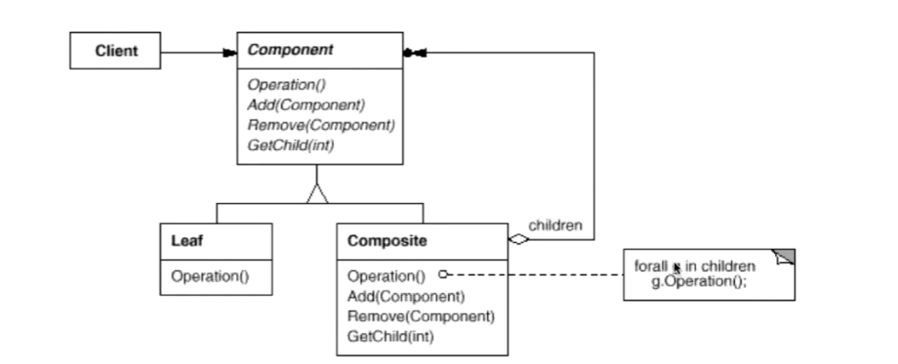

# 1 组合模式Composite

## 1.1 动机

在软件在某些情况下，客户代码过多地依赖对象容器复杂的内部实现结构，对象容器内部实现结构的变化将引起客户代码的频繁变化，带来代码的维护性、可拓展性等弊端

如何将“客户代码与复杂的对象容器结构”解耦？让对象容器自己来实现自身的复杂结构，从而使得客户代码就像处理简单对象一样来处理复杂的对象容器

## 1.2 代码讲解

```C++
class Component {
public:
    virtual void process()=0;
    virtual ~Component() {}
};
```

Leaf和Composite中的共同操作，以便之后利用多态性

```c++
class Composite : public Component {
    string name;
    list<Component*> elements;
public:
    Composite(const string &s) : name(s) {}
    void add(Component* element) { elements.push_back(element); }
    void remove(Component* element) { elements.remove(element); }
    void process() {
        // 处理当前节点
        for (auto &e : elements) // 处理子节点
            e->process() // 多态调用
    }
};
```

上面的Composite即类似树中的根节点，在process处理中，由于elements是一个Component的list对象，所以e->process()是一个多态的调用，如果e是一个Leaf则调用其process()，即是到达了叶子节点，如果e是一个Composite对象，则调用其process()类似一个递归调用，直到Leaf节点才调用结束。

```c++
class Leaf : public Component {
    string name;
public:
    Leaf(string s) : name(s) {}
    void process() {
        // 处理当前结点
    }
};
```

在上面的代码中，用Leaf类和Composite类来当作树中的根节点和叶子节点使用，又将它们的操作抽象出一个Component接口，两个类都实现了这个接口后，就可以通过多态来实现对叶子和根的分别处理，同时又提供一致的接口给用户使用(在这里就是process)。对于用户，无论是处理叶子还是根，无非就是调用其process函数。

## 1.3 模式定义

将对象组合成树形结构以表示“部分-整体”的层次结构。Composite使得客户对单个对象和组合对象的使用具有一致性

## 1.4 结构



## 1.5 要点总结

1. Composite模式采用树形结构来实现普遍存在的对象容器，从而将“一对多”的关系转为“一对一”的关系，使得客户代码可以<u>一致地</u>处理对象和对象容器，无需关心处理的单个对象，还是组合的对象容器
2. 将“客户代码与复杂的对象容器结构”解耦是Composite模式的核心思想，解耦之后，客户代码将与纯粹的抽象接口——而非对象容器的内部实现结构——发生依赖，从而更能“应对变化”
3. Composite模式在具体实现中，可以让父对象中的子对象反向追溯；如果父对象有频繁的遍历需求，可使用缓存技巧来改善效率


