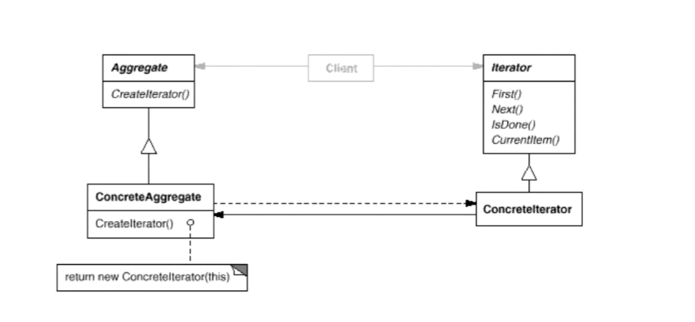

# 1  迭代器Iterator

## 1.1 动机

在软件构建过程中，集合对象内部数据结构常常变化各异。但对于这些集合对象，我们希望在不暴露其内部结构的同时，可以让外部客户代码透明的访问其中的元素；同时这种“透明遍历”也为“同一种算法在多种集合对象上进行操作”提供了可能。

使用面向对象技术将这种遍历机制为“迭代器对象”为应对变化中的集合对象“提供了一种优雅的方式”

## 1.2 代码讲解

C++不是基于面向对象实现的了，现在都是基于泛型编程实现。因为虚函数的调用过程有性能损失，而C++又接受编译时多态

## 1.3 模式定义

提供一种方法顺序访问一个集合对象中的各个元素，而又不暴露该对象的内部表示

## 1.4 结构

## 1.5 要点总结

1. 迭代抽象：访问一个集合对象的内容而无需暴露它的内部表示
2. 迭代多态：为遍历不同的集合结构提供一个同一的接口，从而支持同样的算法在不同集合结构上进行操作
3. 迭代器的健壮性考虑：遍历的同时更改迭代器所在的集合结构会导致问题