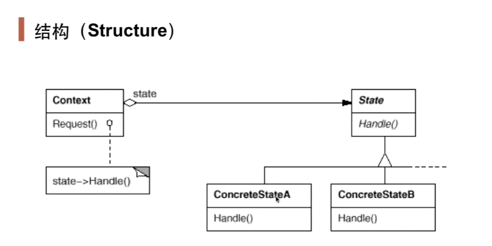

# 状态模式 State

## 1.1 动机

在软件构建过程中，某些对象的状态如果改变，其行为也会随之而发生变化，比如文档处于只读状态，其支持的行为和读写状态支持的行为可能完全不同

如何在运行时根据对象的状态来透明地改变对象的行为？而不会为对象操作和状态转化之间引入紧耦合？

## 1.2 代码讲解

假设我们要根据网络的状态进行行为的调整，实现如下：

```c++
enum NetworkState {
    Network_Open,
    Network_Close,
    Network_Connect
};

class NetworkProcess {
    NetworkState state;
public:
    void Operator1() {
        if (state == Network_Open) {
            //......
            state = Network_Connect;
        } else if(state == Network_Close) {
            //......
            state = Network_Open;
        } else if(state == Network_Connect) {
            //......
            state = Network_Close;
        }
    }
    
    void Operator2() {
        if (state == Network_Open) {
            //......
            state = Network_Connect;
        } else if(state == Network_Close) {
            //......
            state = Network_Open;
        } else if(state == Network_Connect) {
            //......
            state = Network_Close;
        }
    }
};
```

在上面的代码中，最大的问题是，如果我们`NetworkState`的枚举类中添加一个状态，那么为了添加相关的操作，我们还得在`Operator1()`和`Operator2()`的方法里添加`else-if`来判断，进行操作和状态切换。

```c++
class NetworkState {
public:
	NetworkState *pNext;
    virtual void Operator1()=0;
    virtual void Operator2()=0;
    virtual ~NetworkState(){}
};
```

```c++
class OpenState : public NetworkState {
	static NetworkState *m_instance;
public:
    static NetworkState* getInstance() { //返回当前状态
        if(m_instance == nullptr)
            m_instance = new OpenState();
        return m_instance;
    }
    
    void Operator1() {
        //...
        pNext = CloseState::getInstance(); //状态的切换
    }
    void Operator2() {
        //...
        pNext = ConnectState::getInstance();
    }
};

//以此类推，还有CloseState和ConnectState两个状态类
```

```c++
class NetworkProcessor {
    NetworkState* pState;//多态
public:
    NetworkProcessor(NetworkState* pState) {//状态初始化
        this->pState = pState;
    }
    void Operator1() {
        //...
        pState->Operator1();//多态方法
        pState = pState->pNext;//状态发生变化
        //...
    }
    void Operator2() {
        //...
        pState->Operator2();
        pState = pState->pNext;
        //...
    }
};
```

和策略模式一样，我们先把与原先枚举类`NetworkState`状态有关的操作（如`Operator1()`和`Operator2()`）提取到一个接口，并且添加一个`指向状态的指向pNext`用来以后的状态的切换。

然后我们就把三种状态声明成三个类，这三个类实现NetworkState接口，然后在NetworkProcessor中声明一个NetworkState变量的指针pState，这个指针用来控制类的状态。即`pState=pState->pNext`。又在类中的Operator方法中调用当前状态的操作，由于pState是基类，我们就可以通过多态实现在不同的状态下(在构造函数初始化状态，在操作中状态变化)调用不同状态(即子类)下的操作，实现NetworkProcessor的不变。

## 1.3 模式定义

允许一个对象在其内部状态改变时改变它的行为。从而使对象看起来似乎修改了其行为

## 1.4 结构



## 1.5 要点总结

1. State模式将所有与一个特定状态相关的行为都放入一个State的子类对象中，在对象状态切换时，切换相应的对象；但同时维持State的接口，这样实现了具体操作与状态转换之间的解耦
2. 为不同的状态引入不同的对象使得状态转换变得更加明确，而且可以保证不会出现状态不一致的情况，因为转换是原子性的——即要么彻底转换过来，要么不转换
3. 如果State对象没有实例变量，那么各个上下文可以共享同一个State对象，从而节省对象开销

## 1.6 策略模式和状态模式的区别

状态模式将各个状态所对应的操作分离开来，即对于不同的状态，由不同的子类实现具体操作，<u>不同状态的切换由子类实现</u>，当发现传入参数不是自己这个状态所对应的参数，则自己给Context类切换状态；而策略模式是直接依赖注入到Context类的参数进行选择策略，<u>不存在切换状态的操作。</u>

状态模式中类有状态，状态的修改会改变整个类行为。
策略模式没有状态，策略的选择由**客户**决定。

