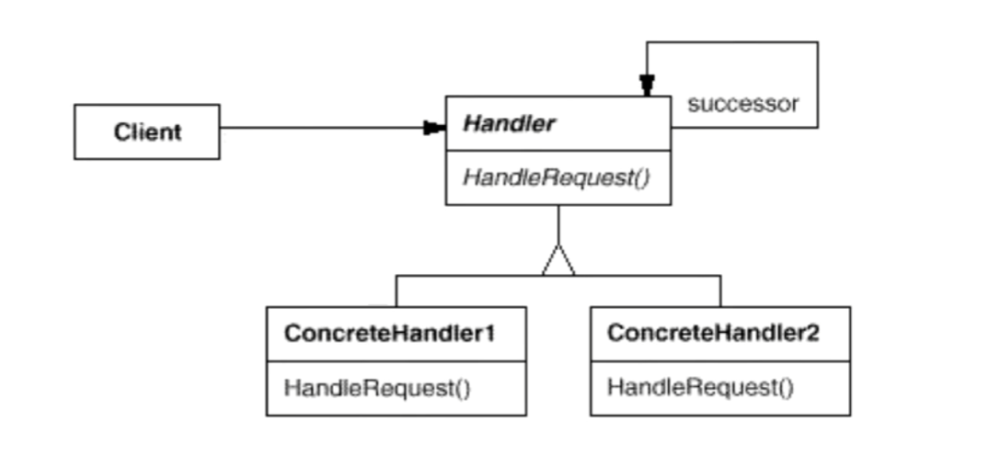

# 1. 职责链模式Chain of Responsibility

## 1.1 动机

在软件构建过程，一个请求可能被多个对象处理，但是每个请求在运行时只能有一个接受者，如果显式指定，将必不可少地带来请求发送者与接受者的紧耦合

如何使请求的发送者不需要指定具体的接受者？让请求的接受者自己在运行时决定来处理请求，从而使两者解耦

## 1.2 代码讲解

```c++
#include <iostream>
#include <string>

using namespace std;

enum class RequestType {
    REQ_HANDLER1,
    REQ_HANDLER2,
    REQ_HANDLER3
};
```

```c++
class Request
{
    string description;
    RequestType reqType;
public:
    Request(const string& desc, RequestType type) :
    	description(desc), reqType(type)
        {        
        }
    RequestType getReqType() const { return reqType; }
    const string& getDescription() const { return description; }
};
```

```c++
class ChainHandler{
private:
    ChainHandler *nextChain;
    void sendRequestToNextHandler(const Reqest& req) 
    {
        if(nextChain!=nullptr)
            nextChain->handle(req);
    }
protected:
    virtual bool canHandlerRequest(const Request& req) = 0;
    virtual void processRequest(const Request& req) = 0;
public:
    ChainHandler() { nextChian = nullptr; }
    void setNextChain(ChainHandler *next) { nextChian = next; }
    
    void handler(const Request& req) 
    {
        if(canHandlerRequest(req))
            processRequest(req);
        else
            sendRequestToNextHandler(req);
	}
};
```

```c++
class Handler1 : public ChainHandler {
protected:
    bool canHandlerRequest(const Request& req) override
    {
        return req.getReqType()==RequestType::REQ_HANDLER1;
    }
    void processRequest(const Request& req) override 
    {
        cout << "Handler1 is handle request: " << req.getDescription() << endl;
	}
};
```

看上面的代码，会发现很像一个链表的实现，事实上就是一种链表实现，但有需要注意：**ChainHandler是一个基类，可以发现nextChian应该具有多态性，形成了多态链表**。

## 1.3 模式定义

使多个对象都有机会处理请求，从而避免请求的发送者和接受者之间的耦合关系。将这些对象连成一条链，并沿着这条链传递请求，直到有一个对象处理它为止。

责任链模式是一种对象行为型模式，其主要优点如下。

1. 降低了对象之间的耦合度。该模式使得一个对象无须知道到底是哪一个对象处理其请求以及链的结构，发送者和接收者也无须拥有对方的明确信息。
2. 增强了系统的可扩展性。可以根据需要增加新的请求处理类，满足开闭原则。
3. 增强了给对象指派职责的灵活性。当工作流程发生变化，可以动态地改变链内的成员或者调动它们的次序，也可动态地新增或者删除责任。
4. 责任链简化了对象之间的连接。每个对象只需保持一个指向其后继者的引用，不需保持其他所有处理者的引用，这避免了使用众多的 if 或者 if···else 语句。
5. 责任分担。每个类只需要处理自己该处理的工作，不该处理的传递给下一个对象完成，明确各类的责任范围，符合类的单一职责原则。

其主要缺点如下。

1. 不能保证每个请求一定被处理。由于一个请求没有明确的接收者，所以不能保证它一定会被处理，该请求可能一直传到链的末端都得不到处理。
2. 对比较长的职责链，请求的处理可能涉及多个处理对象，系统性能将受到一定影响。
3. 职责链建立的合理性要靠客户端来保证，增加了客户端的复杂性，可能会由于职责链的错误设置而导致系统出错，如可能会造成循环调用。

## 1.4 结构



## 1.5 要点总结

1. Chain of Responsibility模式的应用场合在于“**一个请求可能有个接受者，但是最后真正的接受者只有一个**”，这时候请求发送者与接受者的耦合有可能出现“变化脆弱”的症状，职责链的目的就是将二者解耦，从而更好地应对变化
2. 应用了Chain of Resposibility模式后，对象的职责分派将更具灵活性。我们可以在运行时动态添加/修改请求的处理职责
3. 如果请求传递到职责链的末尾仍得不到处理，应该有一个合理的缺省处理。这也是每一个接受对象的责任，而不是发出请求的对象的责任

