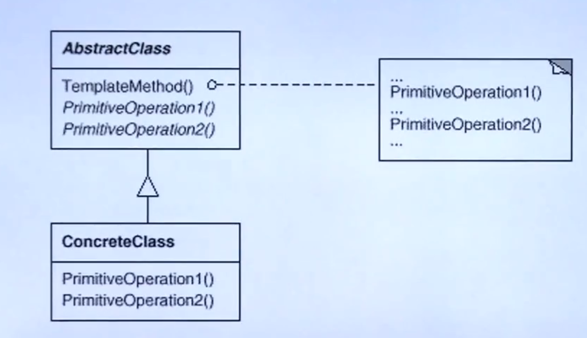

# 组件协作模式

现代软件专业分工之后的第一个结果是"框架与应用的划分"，"组件协作"通过晚绑定，来实现框架与应用程序之间的松耦合，是两者之间协作时常用的模式

# 模板模式 Template Method

## 1.1 动机

在软件构建过程中，对于某一项任务，它常常有稳定的整体结构，但各个子步骤却有很多改变的需求，或者由于固有的原因(比如框架与应用之间的关系)而无法和任务的整体结构同时实现

如何在确定稳定操作结构的前提下，来灵活的应对各个子步骤的变化或者晚期实现需求？

## 1.2 讲解

```c++
class Library{
public:
    void Step1(){
        //...
    }
    
    void Step3(){
        //...
	}
    
    void Step5(){
        //...
    }
};
```

```c++
class Application{
public:
    bool Step2() {
        //...
    }
    void Step4() {
        //...
    }
};

int main() {
    Library lib();
    Application app();
    
    lib.Step1();
    if(app.Step2()){
        lib.Step3();
    }
    for(int i=0;i<4;++i){
        app.Step4();
    }
    Step5();
    return 0;
}
```

假设客户需要使用一个库来实现某个系统，但是相关的实现总是结构呈现出从15行到21行的结构，即增加了库使用者的负担，代码服用也不好，而且未来Application根据需求变动时的拓展性也不好。

所以我们需要将这些结构稳定的代码，做成一个模板，供未来的类使用者调用，如下

```c++
class Library{
public:
    void Run() {
        Step1();
    	if(Step2()){
        	Step3();
    	}
    	for(int i=0;i<4;++i){
        	Step4();
    	}
        Step5();
    }
    virtual ~Library(){ }
protected:
    void Step1(){
        //...
    }
    void Step3(){
        //...
	}
    void Step5(){
        //...
    }
    virtual bool Step2() = 0;
    virtual void Step4() = 0;
};
```

通过将Step2()和Step4()在库中声明成虚函数，供未来的库使用者中实现。未来的调用仅需要通过->调用Run即可，不需要在每一次的重写一样的代码结构，增加了代码的可复用性

不同的类继承Library后都可以对虚函数有不同的实现，然后通过多态的动态绑定，在调用Run()方法时有不同的表现。从而有很好的拓展性

这样写也使得库使用者的负担减少，库使用者不需要知道整个系统的调用过程和结构，只需要关心他所需要重写的方法的实现。具体表现如下

```c++
class Application : public Library {
public:
    virtual bool Step2() {
        //...
    }
    virtual void Step4() {
        //...
    }   
};

int main() {
    Library* lib = new Application();
    lib->Run();
}
```

这样处理后，还有一个好处，一开始是早绑定的，即是Library先写好，然后在main调用。使用了Template Method后。虽然Library也是先写好，但是在Run中已经写好了调用过程，这些调用过程中的纯虚方法在其子类实现，具体表现看起来就是Library调用Application一样。也就是将变化延迟到子类，实现晚绑定。这样对象类型就可以随时更改，即既可以是Application，也可以是别的类，只要继承后实现Step2，Step4，在run里调用就是对应的方法

## 1.3 模式定义

定义一个操作中的算法的骨架(稳定)，从而将一些步骤延迟(变化)到子类中，Template Method使得子类可以不改变(复用)一个算法的结构即可重定义(Override)该算法的某些特定步骤

## 1.4 结构



## 1.5 要点总结

1. Template Method模式是一种非常基础的设计模式，在面向对象系统中有大量的应用。它用简洁的机制(虚函数的多态)为很多应用系统框架提供了灵活的拓展点，是代码复用方面的基本实现结构
2. 除了可以灵活应对子步骤的变化外，"不要调用我，让我来调用你"的反向控制是Template Method的典型应用。
3. 在具体实现方面，被Template Method调用的虚方法可以具有实现，也可以没有任何实现(抽象方法，纯虚方法)，但一般推荐把他设置为protected方法