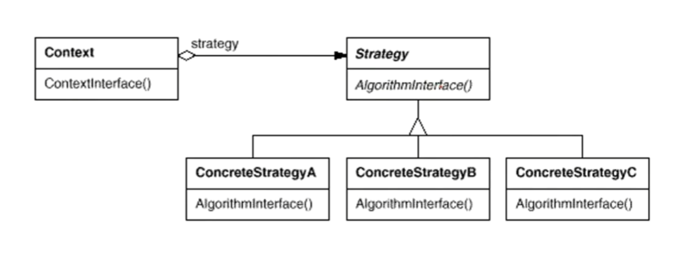

# 策略模式Strategy

## 1.1 动机

在软件构建过程中，某些对象使用的算法多种多样，经常改变，如果将这些算法都编码到对象中，将使对象变得异常复杂；而且有时候支持不使用的算法也是一个性能负担

如何在运行时根据需要透明地更改对象的算法？将算法与对象本身解耦，从而避免上述问题？

## 1.2 讲解

假设我们要处理多个国家的税务的计算，一般来说我们可能会写出如下代码

```c++
enum TaxBase{
    CN_Tax,
    US_Tax,
    DE_Tax
};

class SalesOrder{
public:
    double CalculateTax() {
        //...
        if(tax == CN_Tax){
            //...
        }else if(tax == US_Tax){
            //...
        }else if(tax == DE_Tax){
            //...
        }
        
        //...
    }
private:
    TaxBase tax;
};
```

看起来代码似乎没有问题是不是？但是，这样有个问题，如果我们要增加对法国税务计算的需求，我们是不是又要写一个`if-else`判断语句？而且改变了SalesOrder之后，我们还要重新编译？每一个需求的变更就改if-else语句，if-else语句多了又会有难以维护，可读性差的问题等等.......

所以我们需要对CalculateTax函数里的代码进行解耦，也就是消除if-else语句

```c++
class TaxStrategy{
public:
    virtual double Calculate(const Context& context)=0;
    virtual ~TaxStrategy(){ }
};

class CNTax : public TaxStrategy{
public:
    virtual double Calculate(const Context& context){
        //...
    }
};

class USTax : public TaxStrategy{
public:
    virtual double Calculate(const Context& context){
        //...
    }
};

class DETax : public TaxStrategy{
public:
    virtual double Calculate(const Context& context){
        //...
    }
};
```

```c++
class SalesOrder{
private:
    TaxStrategy strategy;
public:
    SalesOrder(StrategyFactory* strategyFactory) {
        this->strategy = strategyFactory->NewStrategy();
    }
    ~SalesOrder() {
        delete this->strategy;
    }
    
    double CalculateTax() {
        //...
        Context context;
        double val = strategy->Calculate(context);
        //...
    }
};
```

在上述代码中，通过写一个TaxStrategy的接口，将所有要处理的if-else转为子类继承里处理，然后在SalesOrder里声明一个TaxStrategy，通过工厂构造，这样子，在CalculateTax里就能通过多态来动态的处理不同的处理，而不用改变代码结构

如果后续有新的需要，只需要再声明一个类去继承TaxStrategy，然后重写里面的方法，然后再构造SalesOrder时传进去就可通过多态动态的计算税务。也就是不修改，而是拓展的方法。

## 1.3 模式定义

定义一系列算法。把它们一个个封装起来，并且使它们可互相替换(变换)。该模式使得算法可独立于使用它的客户程序(稳定)而变化(拓展，子类化)

## 1.4 结构



## 1.5 要点总结

1. Strategy及其子类为组件提供了一系列可复用的算法，从而可使得类型在运行时方便地根据需要在各个算法之间进行切换
2. Strategy模式提供了用条件判断语句以外地另一种选择，消除条件判断语句，就是在解耦合。含有许多条件判断语句的代码通常都需要Strategy模式
3. 如果Strategy模式对象没有实例变量，那么各个上下文可以共享一个Strategy对象，从而节省开销。也就是配合Singleton模式使用