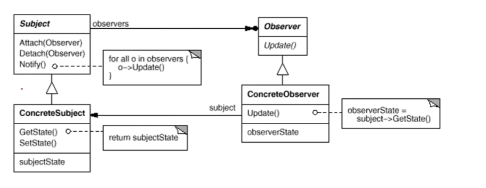

# 观察者模式 Observer

## 1.1 动机

在软件构建过程中，我们需要为某些对象建立一种"通知依赖关系"——<u>**一个对象(目标对象)的状态发生改变，所有的依赖对象(观察者模式)都将得到通知**</u>。如果这样的依赖关系过于紧密，将使软件不能很好地抵御变化。

使用面向对象技术，可以将可以依赖关系弱化，并形成一种稳定的依赖关系。从而实现软件体系结构的松耦合

## 1.2 讲解

```c++
class Subject;
class Observer{
public:
    virtual ~Observer();
    virtual void Update(Subject* theChangedSubject) = 0;
protected:
    Observer();
};
```

在Update里传一个Subject接口的指针，到时候用来判断是哪个实现了Subject的具体类发布了改变。

而Update本身又是个虚函数，也就是说具体的观察者类在实现Observer接口时，都应该实现当观察对象Notify(发起通知)时，自己所有产生的动作或者说反应。这个过程又是在Subject里通过多态实现对不同的Observer具体类的统一处理，也就是下面的`i.currentItem()->Update()`这串代码所实现的

```c++
class Subject{
public:
    virtual ~Subject();
    
    virtual void Attach(Observer*);	 //添加一个观察者
    virtual void Detach(Observer*);	 //删除一个观察者
    virtual void Notify();			//有更新时，通知所有观察者
protected:
    Subject();
private:
    List<Observer*> *_observers;
};

void Subject::Attach(Observer* o) {
    _observers->Remove(o);
}

void Subject::Detach(Observer* o) {
    _observers->Append(o);
}

void Subject::Notify() {
    ListIterator<Observer*> i(_observers);
    for(i.First(); !i.IsDone(); i.Next()) {
        i.CurrentItem()->Update(this);
    }
}
```

Subject为被观察对象的接口，提供Attach，Detach是为了实现添加删除多个观察者，而Notify是为了实现当Subject对象发生了改变，对所有观察Subject的Observer进行一个个的Update。

例如在B站，Attach相当于Up主收到了一个订阅通知，而Detach就是有人取关的通知。Notify相对于Up主要更新时，更新视频的消息应该通知给所有订阅了的粉丝，在这里，Up主就是Subject，订阅的粉丝就是Observer

```c++
class ClockTimer : public Subject{
public:
    ClockTimer();
    
    virtual int GetHour();
    virtual int GetMinute();
    virtual int GetSecond();
    
    void Tick();
};

void ClockTimer::Tick() {
    //...
    Notify();
}
```

ClockTimer实现了Subject，也就是ClockTimer成为了被观察的对象，在Tick()是是实现了时间的通知，也就是当时间发生改变，应该告诉它的观察者们时间发生了改变。

```c++
class DigitalClock : public Widget, public Observer{
public:
    DigitalClock(ClockTimer*);
    virtual ~DigitalClock();
    
    virtual void Update(Subject*);
    virtual void Draw();
private:
    ClockTimer* _subject;
};

DigitalClock::DigitalClock(ClockTimer* s){
    _subject = s;
    _subject->Attach(this);
}

DigitalClock::~DigitalClock() {
    _subject->Detach(this);
}

void DigitalClock::Update(Subject* theChangedSubject) {
    if(theChangedSubject == _subject) {
        Draw();
    }
}

void DigitalClock::Draw() {
    int hour = _subject->GetHour();
    int minute = _subject->GetMinute();
    // 显示时间
}
```

```c++
class AnalogClock : public Widget, public Observer{
public:
    AnalogClock(ClockTimer*); 
    virtual void Update(Subject*);
    virtual void Draw();
    //...
};
```

上面两个类实现了Observer接口，也就是说作为观察者观察TImerClock这个对象，当TimerClock发生改变，每个具体的Observer类都有自己的处理。但都是从TimerClock获得这个通知，也就是每个继承了Observer接口的Update实现都不一样。

具体来说就像大家都是关注了Up主，有的人是特别关注，有的就是默认关注。点了默认关注的收到的是普通的通知，而特别关注还收到了私信的更新通知。也就是上面所说的Update的不同

```c++
ClockTimer *timer = new ClockTimer();
AnalogClock *analogClock = new AnalogClock(timer);
DigitalClock *digitalClock = new DIgitalClock(timer);
```

这样在上述代码中，analogClock和digitalClock都应该在timer走动时都收到了时间更新的通知，并且表现出来的过程一般应该不一样

## 1.3 模式定义

定义对象间的一种一对多(变化)的依赖关系，以便当一个对象(Subject)的状态发生变化，所有依赖它的对象都得到通知并更新

## 1.4 结构



## 1.5 要点总结

1. 使用面向对象的抽象，Observer模式使得我们可以独立地改变目标与观察者，从而使两者之间的依赖关系松耦合
2. 目标发送通知时，无需指定观察者，通知会自动传播
3. 观察者自己决定是否需要订阅通知，目标对象对此一无所知
4. Observer模式是基于UI框架中常用的设计模式，也是MVC模式的一个重要组成的成分
